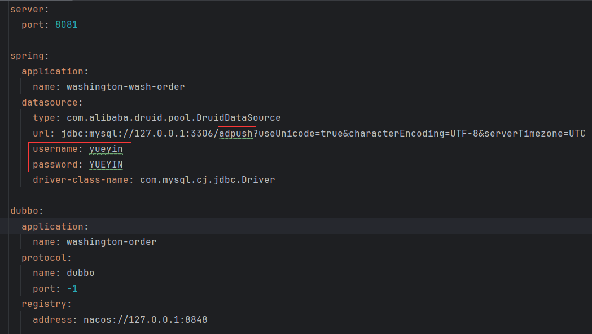
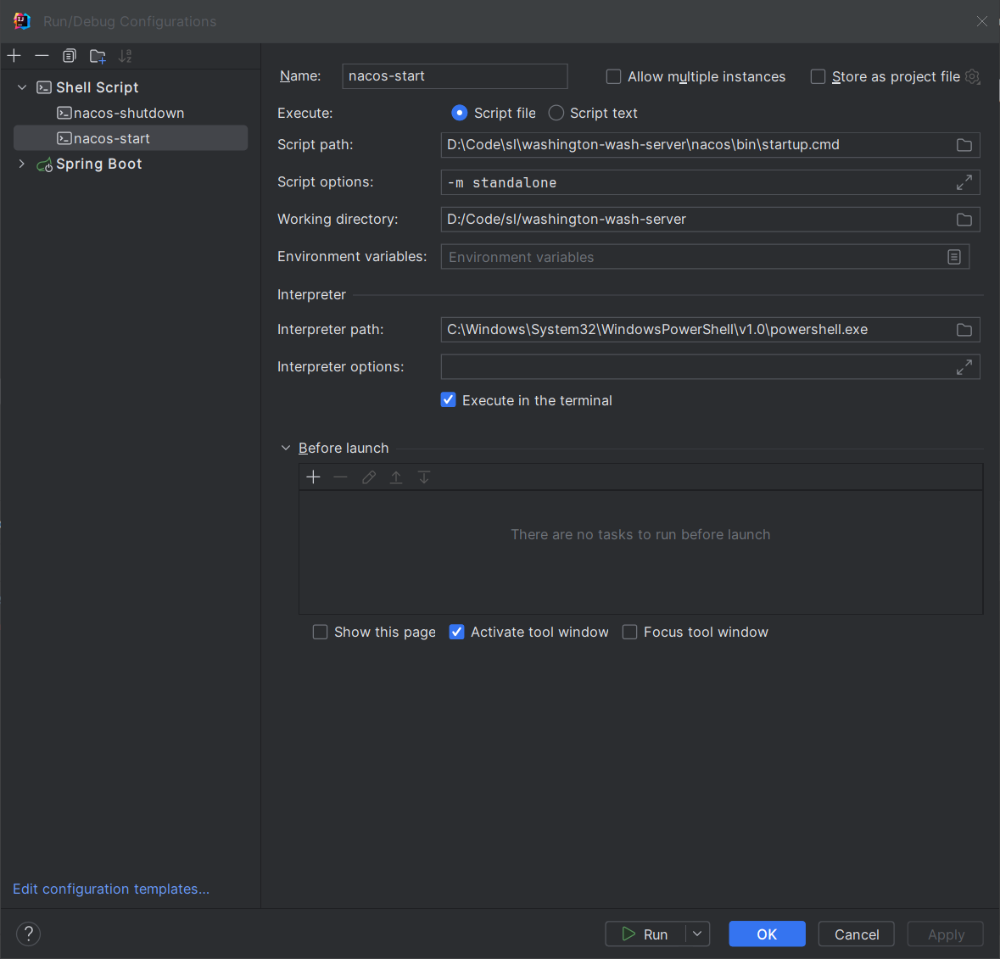

# 需要更改的配置文件

# 项目启动顺序
### 1. 启动nacos
方式1：在命令窗口下，进入nacos/bin目录，接着输入`startup.cmd -m standalone`启动

方式2：如果使用idea，可以将startup.cmd设置为Configuration一键启动

ps：关闭nacos使用同文目录下的shutdown.cmd
### 2.启动所有子模块
如题
# 注册新的远程服务
请仿照washing-wash-order模块中，`com.washingapp.washingtonwashorder.service.impl.OrderServiceImpl`的写法

也可简单理解为，在需要注册的服务上加上@DubboService注解注册

# 调用远程服务
请仿照washing-wash-user模块中，`com.washingapp.washingtonwashuser.controller.UserController`的写法

也可简单理解为，在需要调用的地方，使用@DubboReference注解注入